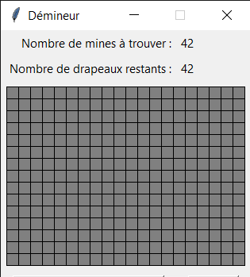

# Démineur Python

Le démineur est un jeu de reflexion où il faut éviter des mines dans une grille de cases.    
Ce programme a été réalisé en Python sous Windows 7 (en 2016 quand j'étais au lycée)  

## Prérequis

Pour faire fonctionner ce programme, vous devez installer :

  - Python (Python3 de préférence)
  
 ## Démarrer
 
Une fois Python installé sur votre machine, ouvrez un invité de commande et lancez la commande suivante :
```
python "Démineur.py"
```

### Commandes

- Clique gauche : Réveler une case
- Clique droit : Poser/Enlever un drapeau un drapeau

### Captures




### Lien utiles

- Installer [Python](https://www.python.org/downloads/)
- Le [Démineur](https://fr.wikipedia.org/wiki/D%C3%A9mineur_(genre_de_jeu_vid%C3%A9o))
